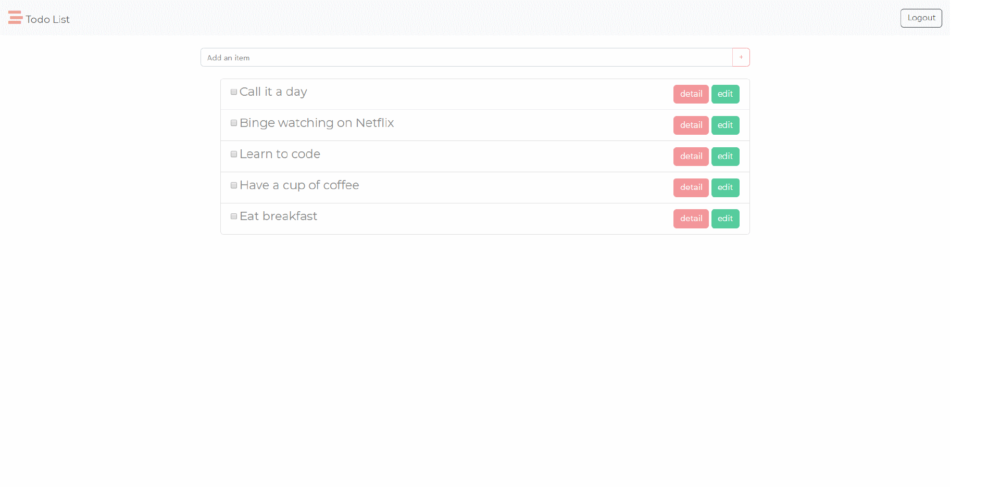

# Todo Sequelize
This is a basic Todo list with Sequelize demo which built up from [Alphacamp](https://tw.alphacamp.co/) semester 3 assignment.



## Feature
1. show todos in updated time descending in default
2. Click the check box to delete the todo.
5. Register, login and Logout feature with **passport-local** and **passport-facebook**.

## Installing

### Git bash

#### git clone

`git clone` to clone the project.

```markdown
git clone https://github.com/mpragnarok/todo-sequelize.git
```
### MySQL Server

Install [MySQL Workbench](https://dev.mysql.com/downloads/workbench/) and connect to local server

Create a new database:

```mysql
drop database if exists todo_sequelize;
create database todo_sequelize;
```

Use database and show the data in the table:

```mysql
use todo_sequelize;
select * from todos;
select * from users;
```

You can list the data in table with `select * from table-name` after you create the user and todo in the server.

### Environment variable

Go to https://developers.facebook.com/ to create your own **App ID** and **App Secret** for restaurant list App

Create `.env` in the root folder

```js
// .env
FACEBOOK_ID = <Your APP ID>
FACEBOOK_SECRET = <Your App Secret>
CALLBACK_DOMAIN = http://localhost:3000
```

### Command line

#### npm install

Install all the packages in the project.

#### npm run dev

Start the server with **nodemon** command.

2. npm run start

Start the server with node command.

#### CTRL + C twice

Stop running server.

### Browser

Head to [http://localhost:3000](http://localhost:3000) to experience the Todo Sequelize demo.

## Description

​	The page has a dynamic index to show up the content of web page which contains front-end and back-end techniques. Front-end part is written in **JavaScript**, **CSS** and **HTML** with **Bootstrap**, back-end part is written in **Node.js** and **Express.js**, server side uses  **MySQL** with **Sequelize**.  

​	The dynamic webpage is made up by **handlebars**. In the home page, it lists all todos with the order in descending update time.

​	Additionally, it has login authentication with local strategy and Facebook strategy which create with **passport.js** , users can only look up the transactions data which they've added.

## packages

#### dependencies with version

1. bcryptjs: 2.4.3
2. body-parser: 1.19.0
3. connect-flash: 0.1.1
5. express: 4.17.1
6. express-handlebars: 3.1.0
7. express-session: 1.16.2
7. grunt-cli: 1.3.2
8. method-override: 3.0.0
9. mysql2: 1.7.0
10. passport: 0.4.0
11. passport-facebook: 3.0.0
12. passport-local: 1.0.0
13. sequelize: 5.19.2


#### devDependency

1. nodemon: 1.19.1
2. dotenv: 8.1.1

## Future Update
1. Click on todo to edit.

2. show the updated time in home page.

3. Sort todos by done condition in root page.

4. Complete user route CRUD:
   1. User avatar upload.
   2. User update password and info page.
   3. Delete user.

   
